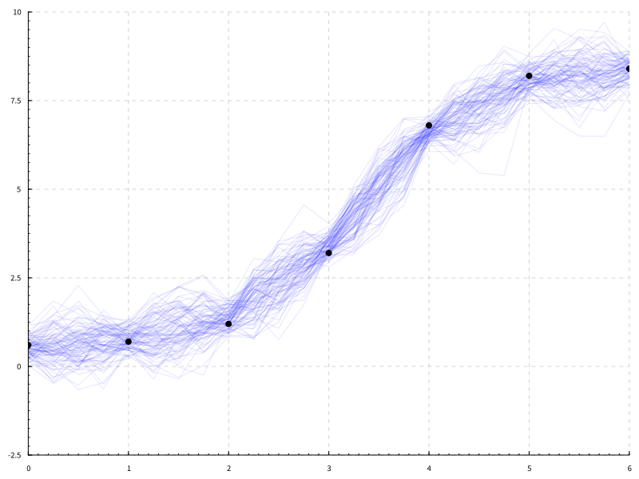
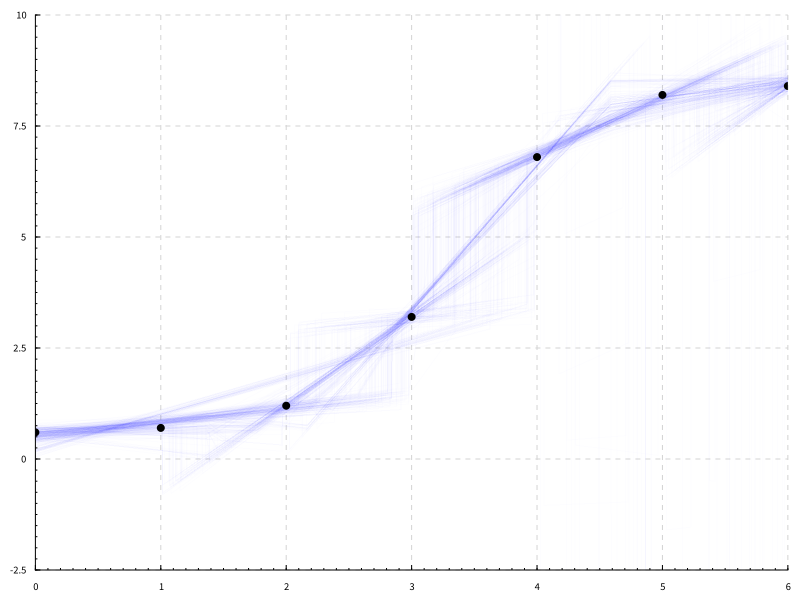
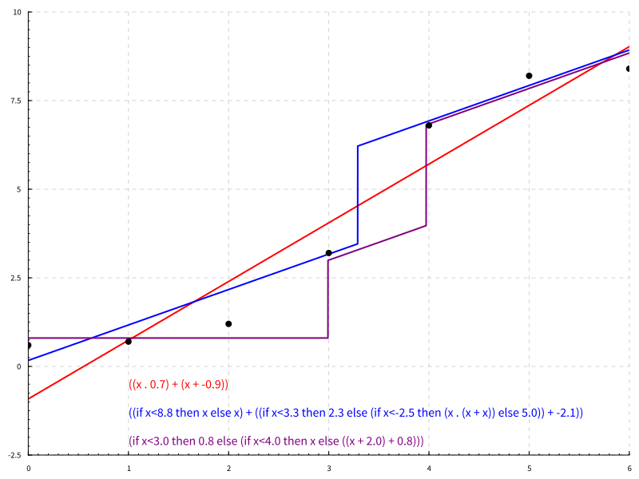

# lazyppl

This provides a simple Metropolis-Hastings implementation in Haskell that works with lazy programs, together with some examples.

To try the different examples, use ``stack run wiener-exe`` and so on.
The source is in ``src/`` .

Laziness appears to be a useful method for specifying non-parametric models. For example, we often use processes or infinite dimensional functions, and this is fine because only finite parts are explored in practice. 

The aim of this implementation is to demonstrate that it's possible to have first-class lazy structures in probabilistic programming. For example, we have first-class

* stochastic memoization: `memoize :: (a -> Prob b) -> Prob (a -> b)`
* Gaussian processes: `wiener :: Prob (Double -> Double)`
* point processes: `poissonPP :: Prob [Double]`
* Dirichlet process: `dp :: Double -> Prob a -> Prob (Prob a)`

The implementation is currently not very fast or memory efficient at all. The Metropolis-Hastings implementation is only ~25 lines of Haskell. 

## Examples

* [``Wiener.hs``](src/Wiener.hs) contains a simple implementation of regression using a Wiener process. Via maintaining a hidden table of previous calls, it appears to be a bona fide random function $R\to R$ that is constructed lazily. Because the functions are built lazily, some values of the functions will be sampled during the simulation, and others just during the plotting.

* [``Regression.hs``](src/Regression.hs) contains the piecewise linear regression. Key idea: the change points are drawn from a lazy Poisson process.

* [``Clustering.hs``](src/Clustering.hs) contains some simple clustering examples, where the number of clusters is unknown. Key uses of laziness: stick-breaking is lazy, and we also use stochastic memoization.

* [``ProgramInduction.hs``](src/ProgramInduction.hs) contains a simple example of program induction over a simple arithmetic language. Key use of laziness: Random expressions are represented as an infinite forest together with a finite path through it.

## Library

* [``LazyPPL.hs``](src/LazyPPL.hs) contains a likelihood weighted importance sampling algorithm (lwis) and a Metropolis-Hastings algorithm, together with the basic monads. There are two monads, `Prob` and `Meas`. 
    * `Prob` is to be thought of as a monad of probability measures. It provides a function `uniform`. 
    * `Meas` is to be thought of as a monad of unnormalized measures. It provides an interface using `sample` (which draws from a `Prob`) and `score` (which weights a trace, typically by a likelihood). 
    * Our Metropolis Hastings algorithm takes as an argument a probability `p` of changing any given site. This is different from single-site MH (which picks exactly one site to change each step) and multi-site MH (which changes all sites at each step). The reason for this is that in the lazy setting we cannot explore how many sites there are without triggering more computation (that would require a lot of Haskell hacking). We can recover single-site MH by putting `p=1/num_sites` and multi-site MH by putting `p=1`. 
    * A key implementation idea is that the underlying sample space is `Tree`, which comprises a lazy tree of `Double`s that is infinitely wide and infinitely deep. Informally, at any moment, if you need some unknown or lazy amount of randomness, you can grab just one branch of the tree, without worrying about affecting the other branches. That branch will itself be a `Tree`, so this can all happen recursively or in a nested way without any problems. 
* [``Distr.hs``](src/Distr.hs) contains common parametric distributions such as normal distributions etc.. We find that the types of Haskell are also quite illuminating for complex distributions, see the types of the processes `memoize`, `wiener`, `poissonPP`, `dp` [above](#lazyppl). We also use abstract types, which capture some essence of exchangeability, for example:
    * in a Chinese Restaurant Process, `newCustomer :: Restaurant -> Prob Table` ([``DirichletP.hs``](src/Distr/DirichletP.hs));
    * in an Indian Buffet Process, `newCustomer :: Restaurant -> Prob [Dish]` ([``IBP.hs``](src/Distr/IBP.hs)).

## Installation

The system uses Haskell stack.
You need to [install stack](https://docs.haskellstack.org/en/v1.1.2/install_and_upgrade/) first if you want to use the system in the
standard way.

To build, type
``stack build``.
This may take some time (>1 hour) if it is your first time ever using stack.

To run, type
``stack run wiener-exe`` or ``stack run regression-exe`` or ``stack run clustering-exe``, or explore with ``stack ghci``.  
